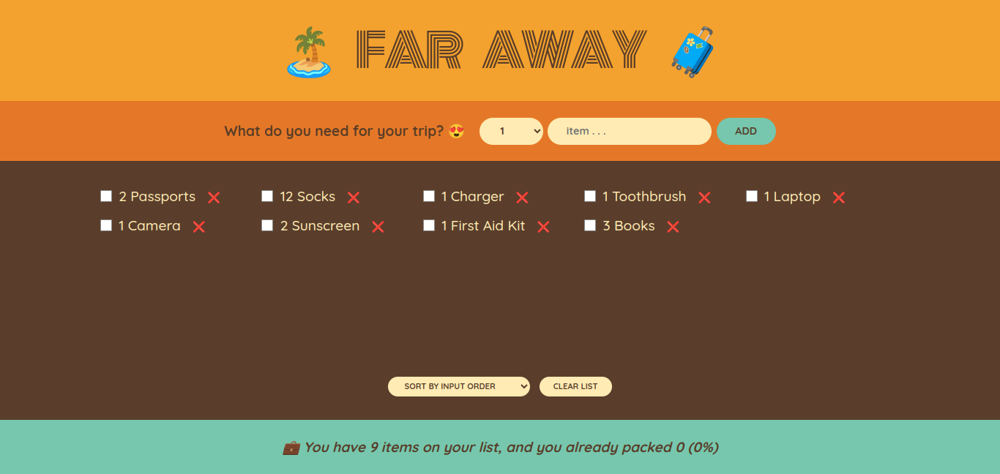

# 🌍 Travel List

Welcome to the Travel List project! This is a React application designed to help you keep track of your travel items.



## 🚀 Demo

Check out the live demo [here](https://travel-list-2193.netlify.app/).

## 📋 Features

- 📐 **Building the Layout:** Organized and user-friendly design.
- 🖼️ **Rendering the Items List:** Dynamic display of your travel items.
- 📝 **Building the Form and Handling Submissions:** Add your travel items easily.
- 🔧 **Implementing Controlled Elements:** Smooth and controlled user inputs.
- ➕ **handle addItems:** Add new items to your list seamlessly.
- 🗑️ **Deleting an Item:** Remove items you no longer need.
- 🔄 **Updating an Item:** Modify your travel items with ease.
- 📊 **Calculating Statistics as Derived State:** Get insights from your travel list.
- 🔢 **Sorting Items:** Keep your list organized.
- 🧹 **Clearing the List:** Start fresh by clearing all items.
- 📁 **Moving Components Into Separate Files:** Well-structured and maintainable codebase.

## 👤 Author

- LinkedIn: [Your LinkedIn Profile](https://www.linkedin.com/in/yourprofile/)
- GitHub: [AnasHany2193](https://github.com/AnasHany2193)

## 🛠️ Installation

1. Clone the repo:
   ```sh
   git clone https://github.com/AnasHany2193/Travel-List.git
   ```
2. Install NPM packages:
   ```sh
   npm install
   ```
3. Run the app:
   ```sh
   npm start
   ```
